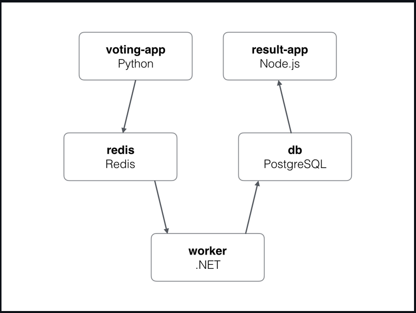

# Kubernetes Voting Application

A microservices-based voting application demonstrating real-time vote counting and display using Kubernetes orchestration.

## Architecture

### Service Communication Flow

```
Voting Frontend (NodePort:30005) → Redis Queue (ClusterIP)
                                        ↓
                                   Worker Service
                                        ↓
Result Frontend (NodePort:30004) ← PostgreSQL (ClusterIP)
```

### Component Architecture

```
External Users
    ↓
NodePort Services
├── Voting UI (30005)
└── Results UI (30004)
    ↓
Internal Services (ClusterIP)
├── Redis (Queue)
├── Worker (Processor)
└── PostgreSQL (Database)
```



## Components

1. **Voting Frontend**

   -  Python web application
   -  Provides voting interface
   -  Port: 80 (internal), 30005 (external)

2. **Redis**

   -  In-memory queue
   -  Temporary vote storage
   -  Enables async processing

3. **Worker**

   -  .NET service
   -  Processes votes
   -  Connects Redis to PostgreSQL

4. **PostgreSQL**

   -  Persistent storage
   -  Stores final results
   -  Used by Results UI

5. **Result Frontend**
   -  Node.js application
   -  Real-time result display
   -  WebSocket updates
   -  Port: 80 (internal), 30004 (external)

## Deployment Instructions

### Local Deployment (Minikube)

1. Start Minikube:

```bash
minikube start
```

2. Deploy all resources:

```bash
# Apply all configurations at once
kubectl apply -f .

# Or apply individually
kubectl apply -f voting-app-deployment.yaml
kubectl apply -f redis-deployment.yaml
kubectl apply -f worker-deployment.yaml
kubectl apply -f postgres-deployment.yaml
kubectl apply -f result-app-deployment.yaml
```

3. Check deployment status:

```bash
# View all resources
kubectl get all

# Check pods
kubectl get pods

# Check services
kubectl get svc
```

4. Access the application:

```bash
# Get URLs
minikube service voting-service --url
minikube service result-service --url
```

### GCP Deployment

1. Create GKE cluster:

```bash
# Create cluster
gcloud container clusters create voting-cluster \
    --num-nodes=3 \
    --zone=us-central1-a

# Get credentials
gcloud container clusters get-credentials voting-cluster \
    --zone=us-central1-a
```

2. Deploy application:

```bash
kubectl apply -f .
```

3. Access the application:

```bash
# Get external IPs
kubectl get svc voting-service result-service
```

## Monitoring and Troubleshooting

### View Resources

```bash
# Get all resources
kubectl get all

# Get specific resource details
kubectl describe pod <pod-name>
kubectl describe service <service-name>
```

### View Logs

```bash
# Container logs
kubectl logs <pod-name>

# Follow logs
kubectl logs -f <pod-name>
```

### Debug Services

```bash
# Port forward to test services locally
kubectl port-forward service/voting-service 8080:80
kubectl port-forward service/result-service 8081:80
```

### Common Issues

1. Pods not starting:

   -  Check pod status: `kubectl describe pod <pod-name>`
   -  View logs: `kubectl logs <pod-name>`
   -  Verify resources: `kubectl get events`

2. Services not accessible:

   -  Check service status: `kubectl get svc`
   -  Verify endpoints: `kubectl get endpoints`
   -  Test connectivity: `kubectl exec <pod-name> -- curl <service-name>`

3. Database connection issues:
   -  Verify PostgreSQL pod is running
   -  Check service DNS resolution
   -  Validate connection strings

## Network Architecture

Internal Service Communication:

```
┌────────────┐     ┌─────────┐     ┌────────┐     ┌────────────┐
│  Voting UI │ ──► │  Redis  │ ──► │ Worker │ ──► │ PostgreSQL │
└────────────┘     └─────────┘     └────────┘     └────────────┘
                                                         ▲
┌────────────┐                                          │
│ Results UI │ ─────────────────────────────────────────┘
└────────────┘
```

Each component runs in isolated pods with their own service endpoints, enabling:

-  Load balancing
-  Service discovery
-  Automatic DNS resolution
-  Internal cluster communication
